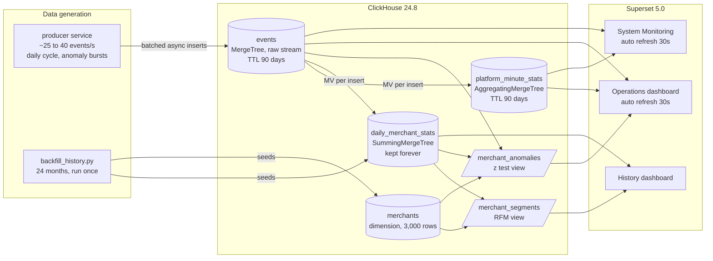
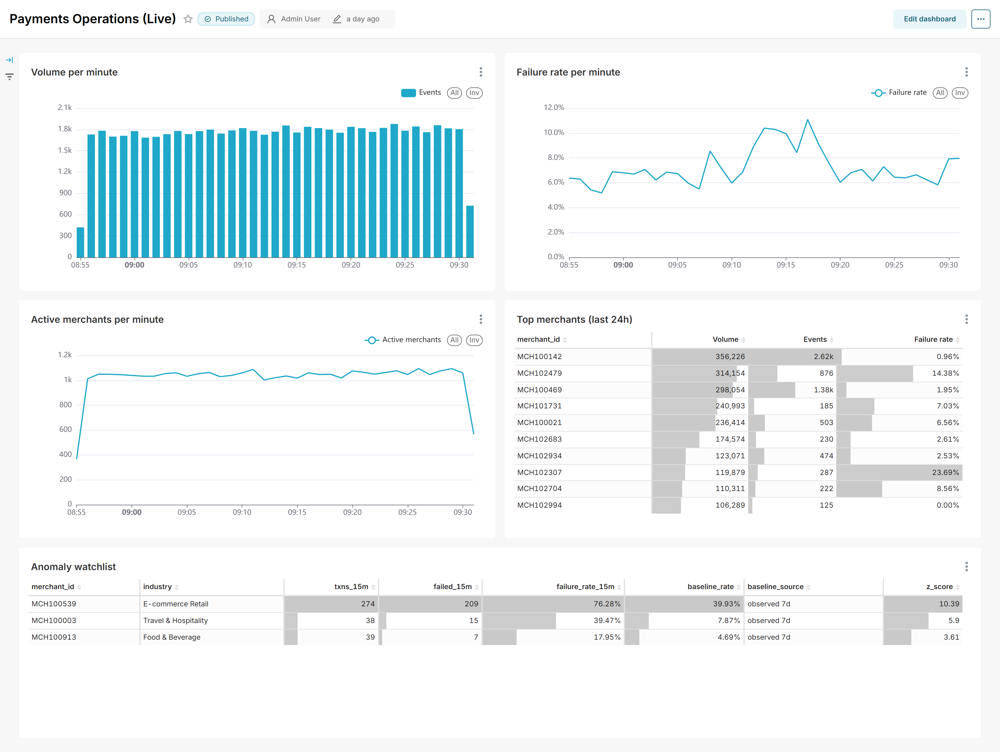
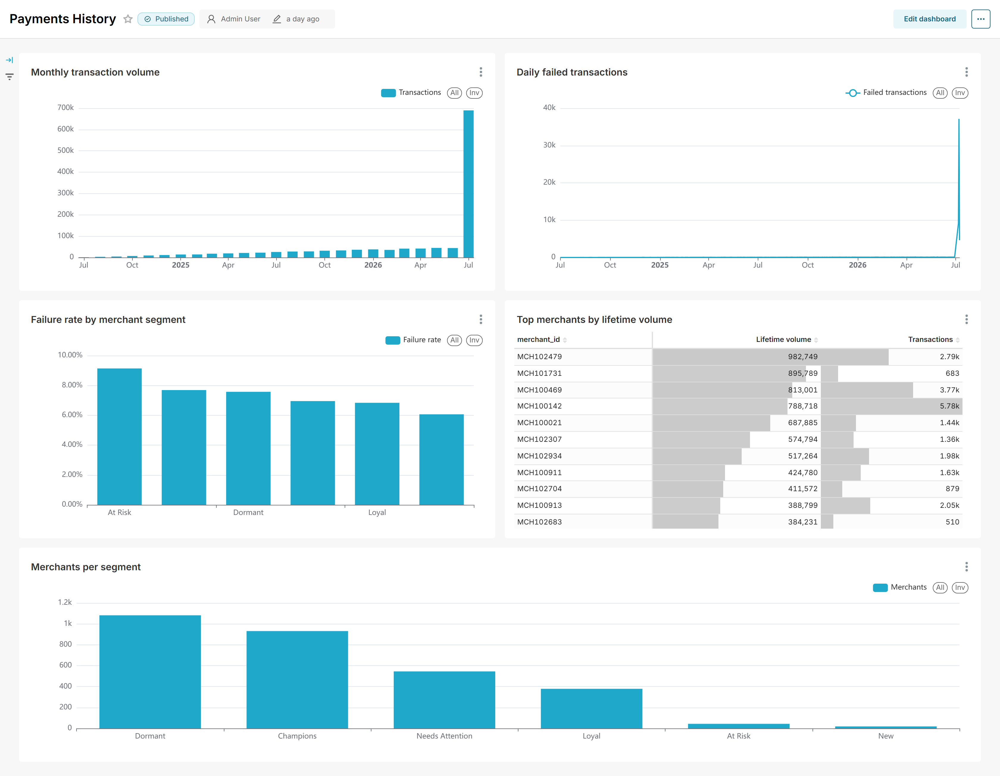
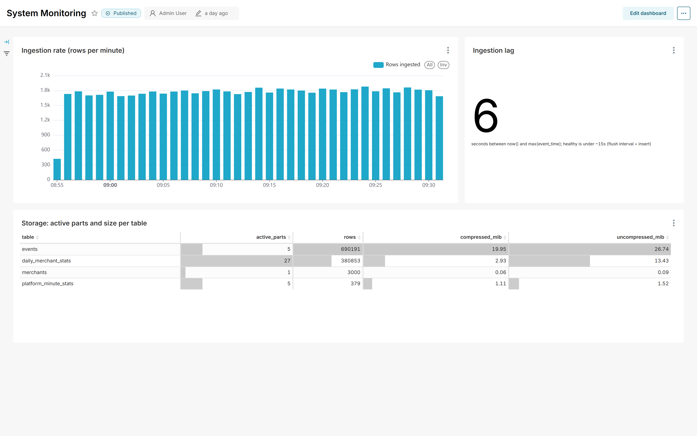

# Live Payments Analytics on ClickHouse and Apache Superset

A running analytics system, not a static demo: a producer service streams payment events around the clock into ClickHouse, materialized views maintain per-minute and per-merchant aggregates as data arrives, an anomaly detector flags merchants whose failure rate breaks from their own baseline, and Superset serves three dashboards on top, including an operations view that refreshes itself every 30 seconds. Everything runs locally on Docker Compose.

The dataset is a simulated acquiring portfolio: 3,000 merchants with individual ticket sizes, activity rates, and decline rates, carrying 24 months of seeded history (reused from my [payment-merchant-clv-segmentation](https://github.com/RidhanPar/payment-merchant-clv-segmentation) project) plus a live stream of ~25 to 40 events per second with daily volume cycles and injected failure bursts.

Built in 12 pull requests, one per stage, each merged after review. The interesting decisions and the failures that shaped them are documented where they live: [docs/SETUP.md](docs/SETUP.md) for the stack, [docs/SCHEMA.md](docs/SCHEMA.md) for the tables, [docs/OPERATIONS.md](docs/OPERATIONS.md) for running it.

## Architecture



The storage contract in one sentence: raw events grow with traffic and expire after 90 days, the daily rollup grows only with merchants times days and is the permanent record, and everything long term reads the rollup.

## Why ClickHouse for streaming analytics

The workload is: events arrive continuously, and every question is an aggregate over many rows and few columns, either "right now" (last minutes to hours) or "over time" (months to years). ClickHouse fits this shape for three reasons that go beyond generic column store points:

- **Columnar reads with a sparse primary index.** Queries read only the columns they name, compressed; the index stores one entry per 8,192 row granule, so per merchant queries read the merchant's contiguous runs instead of the table. Measured below: one merchant's full history costs 29K rows read out of 657K.
- **The merge machinery does the operational work.** Background merges are the same mechanism that compacts small parts, applies the 90 day TTL (dropping whole expired parts), and folds materialized view partials into rollups. Retention and real time aggregation are not extra systems to run; they are properties of tables.
- **Insert batching is the one discipline the writer must keep.** Every insert becomes an immutable part, so the producer buffers 5 seconds of events per insert and sets `async_insert` so the server coalesces further. Result: 657K streamed events in 8 active parts.

The trade: ClickHouse is bad at what OLTP databases are good at (point updates, deletes, high concurrency small transactions). A payments analytics pipeline needs none of those, and Superset generates exactly the aggregate heavy, low concurrency SQL that ClickHouse eats.

## Table engines, and why each one

| Table | Engine | Why this engine |
|---|---|---|
| `events` | MergeTree | Immutable facts, inserted once, never updated. The base engine is the correct default; anything fancier would need justifying. |
| `platform_minute_stats` | AggregatingMergeTree | One metric (distinct active merchants per minute) cannot merge by addition; it needs stored `uniq` state, read back with `uniqMerge`. Plain sums ride along as `SimpleAggregateFunction` columns. |
| `daily_merchant_stats` | SummingMergeTree | Every column is a count or sum, which merge by plain addition. The simpler engine wins where nothing needs aggregate state. |
| `merchant_segments`, `merchant_anomalies` | plain views | 3,000 output rows and a 15 minute window respectively; computing live costs milliseconds and there is nothing to keep fresh. |

Sort keys, partitioning, TTL mechanics, and the two materialized view traps (they never re-read existing data, and their targets must be read with re-aggregation) are reasoned through in [docs/SCHEMA.md](docs/SCHEMA.md).

## Run it

```bash
git clone https://github.com/RidhanPar/clickhouse-payments-analytics.git
cd clickhouse-payments-analytics
docker compose up -d --build        # ClickHouse, Superset, metadata DB, producer; schema auto-applied
pip install -r requirements.txt
python scripts/backfill_history.py  # seed merchants + 24 months of history (run before the producer has data to stream against)
python scripts/build_dashboard.py   # build all three dashboards, or import superset/exports/payments_dashboards.zip
python scripts/verify_live.py       # optional: prove the whole thing works end to end
```

Superset runs at http://localhost:8088 (admin / admin_local unless changed in `.env`). The producer starts streaming as soon as the backfill gives it a merchant book; it waits and retries until then, so start order does not matter. Producer rate, flush interval, and anomaly cadence are tunable in `.env` (see `.env.example`).

## The data

History: the seeded generator produces 575,226 transactions across 24 months with lognormal ticket sizes and activity rates, industry dependent decline rates, and a churned subset. The backfill aggregates it to daily grain and loads it into the rollup at ~197K rows/s (raw history would just be TTL fodder; the storage split is the point).

Live stream: the producer gives each merchant a personality from the dimension table and weights traffic by each merchant's trailing 90 day volume, so churned merchants stay churned (learned the hard way; the first version resurrected the whole book and broke recency segmentation, documented in SCHEMA.md). Volume follows a daily cycle, failures follow per merchant decline rates, and roughly every 15 minutes one merchant bursts to a 55 to 80 percent failure rate for a few minutes, logged as ground truth for the detector.

## Dashboards

Three dashboards, built as code by [scripts/build_dashboard.py](scripts/build_dashboard.py) through the Superset REST API and exported to [superset/exports/payments_dashboards.zip](superset/exports/payments_dashboards.zip) (imports prompt for the ClickHouse password; Superset masks it in exports).

| Dashboard | Refresh | Reads | Shows |
|---|---|---|---|
| Payments Operations (Live) | 30 s | minute rollup, raw events, anomaly view | per minute volume and failure rate (3h), active merchants, top merchants (24h), anomaly watchlist |
| Payments History | manual | daily rollup, segment views | monthly volume, daily failures, failure rate by RFM segment, lifetime top merchants, segment sizes |
| System Monitoring | 30 s | minute rollup, raw events, system.parts | ingestion rate, ingestion lag, active parts and size per table |

The history dashboard touches nothing but rollups, so it stays fast forever regardless of stream volume and is unaffected by raw retention.

## Anomaly detection

`merchant_anomalies` is a view, not a pipeline: every dashboard refresh recomputes it in ~34 ms. It flags merchants whose failure rate over the last 15 minutes sits 3.5+ standard deviations (pooled two-proportion z test) and 5+ absolute points above their own baseline, where the baseline is the merchant's observed trailing 7 days when thick enough and its configured decline rate otherwise. Both refinements exist because earlier versions produced real false positives against the live stream; the SQL comments in [clickhouse/init/06_merchant_anomalies.sql](clickhouse/init/06_merchant_anomalies.sql) tell that story, and the verification section below shows the detector catching an injected burst with zero noise.

## Screenshots

Captured from the running stack (scripted with Playwright; the stream had been running for two days).

**Payments Operations (Live)**, auto refreshing every 30 seconds. The anomaly watchlist at the bottom caught an injected burst in real time: MCH100539 at a 76% failure rate over 274 events against its 40% observed baseline, z of 10.4.



**Payments History**, reading only the daily rollup and segment views. The July 2026 spike is the two days of dense live streaming folded into the daily grain alongside the 24 months of seeded history.



**System Monitoring**: ingestion rate per minute, ingestion lag as a single number (6 seconds behind wall clock here), and active parts per table. The events table holds 690K rows in 5 active parts, which is the insert batching discipline made visible.



## Benchmarks (measured on the running system)

Run by [scripts/benchmark.py](scripts/benchmark.py) while the producer streamed: median of 5 runs after a warmup, Docker Desktop for Windows, ClickHouse 24.8. At benchmark time the stream had accumulated 657,686 raw events over roughly two days of running, alongside 380,877 daily rollup rows carrying 24 months of history. Server execution comes from `system.query_log`; end to end includes the HTTP round trip through Docker's network stack, which adds a near constant ~45 ms on this machine and would be the first thing to investigate if these were user facing latencies.

| Query | Server execution | End to end (HTTP) | Rows read | Data read |
|---|---|---|---|---|
| Per-minute volume, last 3h (minute rollup) | 6 ms | 51 ms | 361 | 7.05 KiB |
| Per-minute volume, last 3h (raw events) | 8 ms | 55 ms | 90,609 | 442.43 KiB |
| Active merchants per minute, last 3h (uniqMerge) | 24 ms | 69 ms | 362 | 32.52 KiB |
| One merchant's raw event history (primary key hit) | 8 ms | 52 ms | 28,960 | 370.80 KiB |
| Anomaly watchlist, full view | 34 ms | 76 ms | 188,247 | 1.36 MiB |
| Monthly volume, 25 months (daily rollup) | 12 ms | 57 ms | 381,047 | 9.45 MiB |
| Daily failures, full history (daily rollup) | 10 ms | 57 ms | 381,047 | 3.63 MiB |
| Full RFM segmentation, computed live | 41 ms | 70 ms | 384,076 | 13.09 MiB |

What the numbers show, honestly:

- **The minute rollup earns its keep in rows read.** The same per-minute answer costs 361 rows via the rollup against 90,609 via raw events, a 250x IO saving that grows linearly with traffic, even though both still finish in single digit milliseconds at this volume. The wall clock gap comes with scale; the IO gap is already real.
- **Part pruning limits even the raw scan.** The 3 hour raw query read 90,609 of 657,686 rows without any help from the sort key (event_time is the second key column): ClickHouse skipped older parts entirely using per-part min/max metadata, because parts written by a stream are naturally time ordered.
- **The sparse primary index works.** One merchant's full two-day history read 28,960 rows out of 657K: MergeTree reads whole 8,192 row granules around the merchant's contiguous runs rather than scanning the table.
- **`uniqMerge` finalizes stored HyperLogLog states** from the AggregatingMergeTree in 24 ms; computing distinct merchants per minute from raw events on every dashboard refresh would re-scan the stream each time.
- **The anomaly watchlist, the most complex query in the system** (a 15 minute raw window, a 7 day baseline union, a join to the dimension table, and a pooled two-proportion z test), runs in 34 ms on the server. This is why detection is a view instead of a pipeline: there is nothing to schedule, restart, or fall behind.
- **Insert side:** the bulk backfill sustained ~197K rows/s in 100K batches. The live producer streams ~25 to 40 events/s (by design) with an observed ingestion lag of 1 to 6 seconds, and 657K streamed events sit in 8 active parts, which is the batching plus `async_insert` discipline doing its job.

## End to end verification

[scripts/verify_live.py](scripts/verify_live.py) checks the running system: TTL present in the DDL, events flowing (rate over a 45 s window), ingestion lag under 30 s, exact materialized view consistency (raw count = minute rollup sum = daily rollup sum), insert batching health (active part count), and that an injected anomaly burst is caught by the watchlist while it runs. The script identifies the burst merchant from the raw data itself (no natural merchant exceeds a 40% failure rate on 100+ events in 10 minutes), so detection is verified against ground truth rather than against the detector's own opinion.

The first full run of this script is what exposed the watchlist precision problem described in the anomaly view comments (7 thin-baseline false positives beside the real burst), which is the point of running verification against a live stream instead of eyeballing a demo. After switching the detector to a pooled two-proportion z test at 3.5 sigma, the rerun passed 8 of 8:

```
PASS  TTL on events: 90 day TTL with ttl_only_drop_parts
PASS  TTL on platform_minute_stats: 90 day TTL with ttl_only_drop_parts
PASS  events flowing: 1431 events in 45s (31.8/s)
PASS  ingestion lag: 2s behind wall clock (threshold 30s)
PASS  materialized view consistency: events=633,618 minute_rollup=633,618 daily_rollup=633,618
PASS  insert batching (active parts): 633,618 rows in 8 active parts
PASS  anomaly detection: ground truth burst MCH100539 (73% over 106 events) is on the watchlist (watchlist size 1)
PASS  watchlist precision: 1 merchants listed during burst (expect the burst plus at most stray 3 sigma noise)
```

## Documentation map

- [docs/SETUP.md](docs/SETUP.md): every configuration choice in the Compose stack, image pinning, ports, volumes, secrets, the Superset bootstrap, and the driver installation trap in the Superset 5 image.
- [docs/SCHEMA.md](docs/SCHEMA.md): the storage strategy, sort keys, partitioning, TTL mechanics, engine choices, and the segmentation fixes that live data forced.
- [docs/OPERATIONS.md](docs/OPERATIONS.md): health triage, data flow checks, system table queries with observed healthy values, TTL behavior, tested backup and restore, and failure modes seen while building.
